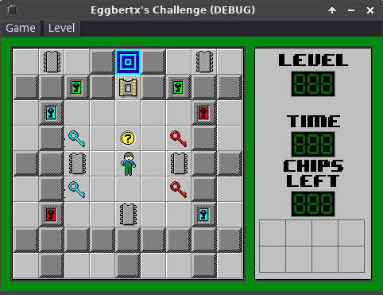

# Eggbertx's Challenge

A work-in-progress implementation of Chip's Challenge in the Godot game engine.

<!-- ## Preview

The Godot theme used comes from [this](https://github.com/violinbg/godot-desktop-themes) repository, slightly modified to fix a couple minor issues. -->

## Tests
There are unit tests in `./test/` that can be executed using [GdUnit4](https://mikeschulze.github.io/gdUnit4/). To run them, open the project in the Godot editor, click on the GdUnit tab to the right of the Scene and Import tabs, then click Run or Debug.
You can also run them from the command line by running `addons/gdUnit4/runtest.cmd -a ./test/` in Windows or `addons/gdUnit4/runtest.sh -a ./test/` in Linux, macOS, and BSD.

See https://mikeschulze.github.io/gdUnit4/advanced_testing/cmd/ for more info on running GdUnit4 unit tests from the command line.
